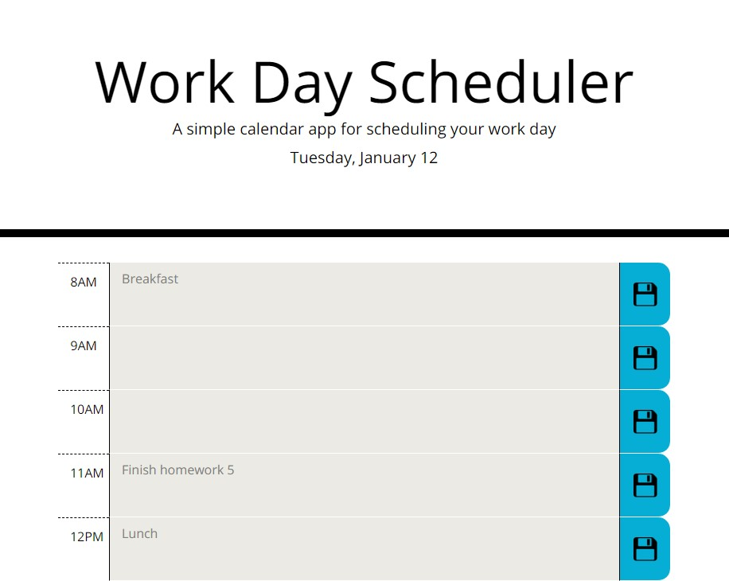
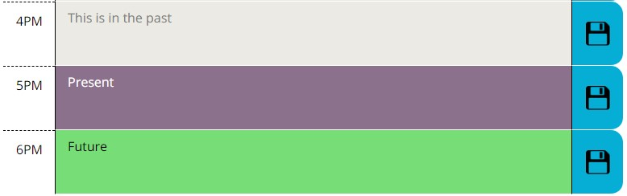

# Day Planner

## Description

A day planner, written in mostly jquery, that saves activities to the local storage and also keeps track of the date and hour, and changes the page accordingly.

## Usage

The header at the top gets the date from the dayjs.js library.  It shows the day of the week, month and date.

The calendar is color coded for past, present, and future appointment.  The hour is compared to the hour from the dayjs library.

Click inside the text fields to enter your daily appointments.

Click the save icon to the right of the appointment to save the appointment to local storage.  When the page is refreshed, the data that was saved persists.

## Links

Github link: https://github.com/TimMartin13/day_planner

Published link: https://timmartin13.github.io/day_planner/

